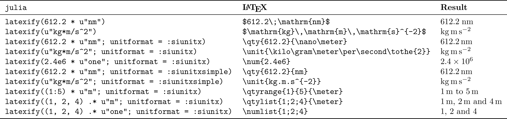
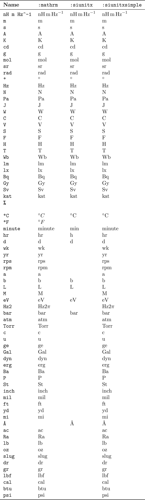

# Latexify extension

Unitful has an extension for [Latexify](https://github.com/korsbo/Latexify.jl), which was formerly implemented as a separate package called UnitfulLatexify.jl.

The default usage is pretty intuitive:

```@example main
using Unitful, Latexify

a = 9.82u"m/s^2"
t = 4u"s"
x = a*t^2

latexify(x)
```

or more usefully:

```@example main
latexify(:(x = a*t^2 = $x))
```

This of course also works for `Units` objects by themselves:

```@example main
latexify(u"kg*m")
```

Some more usage examples:




## Arrays

Because Latexify is recursive, an array of unitful quantities is shown as
expected:


```@example main
latexify([12u"m", 1u"m^2", 4u"m^3"])
```

A special case is an array where all elements have the same unit, and here
UnitfulLatexify does some extra work:
```@example main
latexify([1, 2, 3]u"cm")
```


## siunitx.sty

If you are exporting your numbers to an actual LaTeX document, you will of
course want to use the commands from `siunitx.sty` rather than the `\mathrm`
style used by default. To this end you can use Latexify's `fmt=SiunitxNumberFormatter` for `\qty{8}{\second\meter\per\kilo\gram}` style and `fmt=SiunitxNumberFormatter(simple=true)` for
`\qty{8}{s.m/kg}`. Like other Latexify keywords, this can be set to be a default
by using `set_default(fmt=SiunitxNumberFormatter())`, or given with each latexification
command:

```@example main
latexify(612.2u"nm"; fmt=SiunitxNumberFormatter()) # This will not render right without the `siunitx` package
print(ans) # hide
```

### Lists

Another thing that `siunitx` does uniquely is lists and ranges of quantities.
To get `siunitx`'s list behavior, pass a tuple instead of an array;
if you want a tuple to be written as an array instead, use `collect(x)` or `[x...]` to explicitly it into an array first.

```@example main
string.([
latexify((1:5)u"m"),
latexify((1:5)u"m"; fmt=SiunitxNumberFormatter()),
latexify(collect((1:5)u"m"); fmt=SiunitxNumberFormatter()),
latexify((1u"m", 2u"m", 3u"m"); fmt=SiunitxNumberFormatter()),
])
```


## Plots labels

This extension also interfaces with `Plots` by way of implementing a two-argument `(label, unit)` recipe:

```@example main
latexify("v", u"km/s")
```

This enables this dreamlike example:

```
using Unitful, Plots, Latexify 
gr()
default(fontfamily="Computer Modern")

m = randn(10)u"kg"
v = randn(10)u"m/s"
plot(m, v; xguide="\\mathrm{mass}", yguide="v_x", unitformat=latexify)
```

This format, ``v_x\;\left/\mathrm{m}\,\mathrm{s}^{-1}\right.``, is subject to personal
preference. A couple other defaults are provided:
- `:slash`, ``v_x\;\left/\mathrm{m}\,\mathrm{s}^{-1}\right.``
- `:round`, ``v_x\;\left(\mathrm{m}\,\mathrm{s}^{-1}\right)``
- `:square`, ``v_x\;\left[\mathrm{m}\,\mathrm{s}^{-1}\right]``
- `:frac`, ``\frac{v_x}{\mathrm{m}\,\mathrm{s}^{-1}}``

To use these in a plot call, either pass a function like 
```
(l,u) -> latexify(l, u; labelformat=:slash)` 
```
or call `Latexify.set_default(labelformat=:square)`, the pass `latexify` as your unitformat.

```
args = (m, v)
kwargs = (xguide="\\mathrm{mass}", yguide="v_x", legend=false)
Latexify.set_default(labelformat=:square)
plot(
	plot(args...; kwargs..., unitformat=(l,u)->latexify(l, u, :slash)),
	plot(args...; kwargs..., unitformat=(l, u)->latexify(l, u, :round)),
	plot(args...; kwargs..., unitformat=latexify),
	plot(args...; kwargs..., unitformat=(l, u)->latexify(l, u, :frac)),
	plot(args...; kwargs..., unitformat=(l, u)->string("\$", l, " \\rightarrow ", latexraw(u), "\$")),
)
```

## Pluto notebooks
One use case is in Pluto notebooks, where you can
write

```julia
Markdown.parse("""
The period is $(@latexrun T = $(2.5u"ms")), so the frequency is $(@latexdefine f = 1/T post=u"kHz").
""")
```
, which renders as

> The period is $T = 2.5 \mathrm{ms}$, so the frequency is $f = \frac{1}{T} = 0.4 \mathrm{kHz}$.

Note that the quantity has to be interpolated (put inside a
dollar-parenthesis), or Latexify will interpret it as a multiplication between
a number and a call to `@u_str`.


## Per-modes

In mathrm-mode, one might prefer ``\mathrm{J}\,/\,\mathrm{kg}`` or
``\frac{\mathrm{J}}{\mathrm{kg}}`` over ``\mathrm{J}\,\mathrm{kg}^{-1}``. This
can be achieved by supplying `permode=:slash` or `permode=:frac` respectively.

These will have no effect with `SiunitxNumberFormatter`, because the latex package handles
this for you, and you can set it in your document.

## New siunitx syntax

The new syntax from `siunitx v3` (`\qty, \unit` rather
than `\SI, \si`) is used by default. If you cannot upgrade `siunitx`, there's the option
to use `fmt=SiunitxNumberFormatter(version=2)`.

## A more complete list of defined units

Below is a poorly scraped list of units defined in `Unitful` and what comes out
if you run it through `latexify`. Feel free to create an issue if there's a
unit missing or being incorrectly rendered (and suggest a better ``\LaTeX``
representation if you know one).


